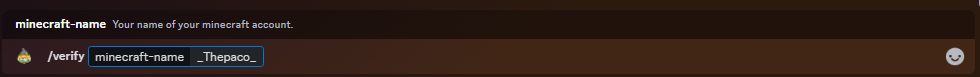

# ⚒️ Rango mc

## Paso 1

Usa el comando <mark style="color:purple;">`/verify Nick`</mark> en discord ( Tienes que estar conectado dentro del servidor )

<figure><figcaption></figcaption></figure>

## Paso 2

Dentro del servidor te saldrá este mensaje, Tienes que darle a <mark style="color:green;">**accept**</mark>&#x20;

<figure><figcaption></figcaption></figure>

Cuando termines la verificación el rango que tengas dentro de minecraft los tendras en discord automáticamente.
